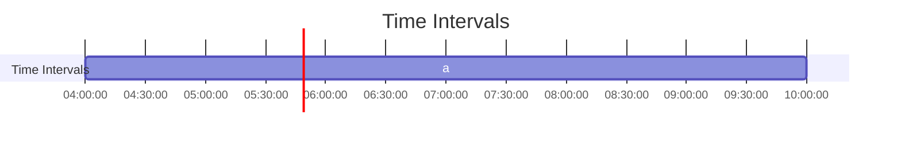

# Mind the Gap


> A powerful library for working with Intervals, Relations, and Algorithms.

[](https://github.com/gchudnov/mindthegap/actions/workflows/scala.yml)
[](LICENSE)
[](https://gchudnov.github.io/mindthegap/)

<br clear="right" /><!-- Turn off the wrapping for the logo image. -->

## Overview

**Mind the Gap** is a Scala library designed to simplify working with **intervals**, **relations**, and **algorithms**. It supports a wide variety of operations for interval arithmetic, Allen's Interval Algebra, and interval-based algorithms like intersection, union, and more.

This library is ideal for projects requiring precise control over intervals, whether you're working with time intervals, numeric ranges, or custom domains.

## Features

- **Interval Operations**: Support for open, closed, bounded, and unbounded intervals.
- **Allen's Interval Algebra**: Full support for 13 relations between intervals (before, overlaps, meets, etc.).
- **Algorithmic Functions**: Includes intersection, span, union, gap, grouping, and more.
- **Diagram Generation**: Generate interval diagrams in both ASCII and Mermaid formats.
- **Custom Domains**: Easily extend to work with new data types.

## Getting Started

To start using **Mind the Gap**, add the following dependency to your `build.sbt`:

```scala
libraryDependencies += "com.github.gchudnov" %% "mtg" % "2.0.1"

// Optional dependencies for diagram generation
libraryDependencies += "com.github.gchudnov" %% "mtg-diagram-ascii" % "2.0.1"   // ASCII diagrams
libraryDependencies += "com.github.gchudnov" %% "mtg-diagram-mermaid" % "2.0.1" // Mermaid diagrams
```

### Example: Interval Intersection

Here’s a simple example of how to compute the intersection of two intervals:

```scala
package com.example

import com.github.gchudnov.mtg.*
import com.github.gchudnov.mtg.diagram.*

object Hello extends App:
  // Calculate the intersection of two intervals
  val a = Interval.closed(0, 5) // [0,5]
  val b = Interval.closed(1, 6) // [1,6]
  
  val c = a.intersection(b) // [1,5]
  println(c) // Output: [1,5]

  // Render the diagram
  val renderer = AsciiRenderer.make[Int]()
  val diagram = Diagram
    .empty[Int]
    .withSection { s =>
      List(a, b, c).zipWithIndex.foldLeft(s) { case (s, (i, k)) =>
        s.addInterval(i, s"${('a' + k).toChar}")
      }
    }

  renderer.render(diagram)
  println(renderer.result)
  //     [****************************]         | [0,5] : a
  //           [****************************]   | [1,6] : b
  //           [**********************]         | [1,5] : c
  //   --+-----+----------------------+-----+-- |
  //     0     1                      5     6   |
```

### Example: Mermaid Diagram for Intervals

You can also generate diagrams using Mermaid, which can be visualized using [Mermaid Live Editor](https://mermaid.live):

```scala
import com.github.gchudnov.mtg.*
import com.github.gchudnov.mtg.diagram.*
import java.time.*

val t1 = LocalTime.parse("04:00")
val t2 = LocalTime.parse("10:00")

val a = Interval.closed(t1, t2)
val renderer = MermaidRenderer.make[LocalTime]
val diagram = Diagram.empty[LocalTime]
  .withTitle("Time Intervals")
  .withSection { s =>
    s.addInterval(0, "a", a)
  }

renderer.render(diagram)
println(renderer.result)
```



## Documentation

You can find the full **Mind the Gap** documentation [on the website](https://gchudnov.github.io/mindthegap/). The documentation provides in-depth explanations, examples, and detailed API references.

## Useful Links

- [Allen's Interval Algebra](https://www.ics.uci.edu/~alspaugh/cls/shr/allen.html) — A deep dive into the theory behind Allen's Interval Algebra.

## Keywords

Allen's Interval Algebra, Interval Arithmetic, Interval Relations, Infinite Temporal Intervals, Temporal Algorithms, Diagrams

## License

This project is licensed under the [MIT License](LICENSE).

## Contact

For questions, issues, or feature requests, feel free to [contact Grigorii Chudnov](mailto:g.chudnov@gmail.com) or open an issue in the GitHub repository.
