# mindthegap



> Intervals, Relations and Algorithms

[](https://github.com/gchudnov/mindthegap/actions/workflows/scala.yml)

<br clear="right" /><!-- Turn off the wrapping for the logo image. -->

## Documentation

You can find _mindthegap_ documentation [on the website](https://gchudnov.github.io/mindthegap/).

## Usage

Add the following dependency to your `build.sbt`:

```scala
libraryDependencies += "com.github.gchudnov" %% "mtg" % "2.0.0"

// optional dependencies to draw diagrams
libraryDependencies += "com.github.gchudnov" %% "mtg-diagram-ascii" % "2.0.0"   // ascii
libraryDependencies += "com.github.gchudnov" %% "mtg-diagram-mermaid" % "2.0.0" // mermaid
```

An example application:

```scala
package com.example

import com.github.gchudnov.mtg.*
import com.github.gchudnov.mtg.diagram.*

object Hello extends App:
  // calculate intersection of two intervals
  val a = Interval.closed(0, 5) // [0,5]
  val b = Interval.closed(1, 6) // [1,6]

  val c = a.intersection(b) // [1,5]

  println(c)
  // [1,5]

  // render the diagram
  val renderer = AsciiRenderer.make[Int]()
  val diagram = Diagram
    .empty[Int]
    .withSection { s =>
      List(a, b, c).zipWithIndex.foldLeft(s) { case (s, (i, k)) =>
        s.addInterval(i, s"${('a' + k).toChar}")
      }
    }

  renderer.render(diagram)

  println(renderer.result)
  //     [****************************]         | [0,5] : a
  //           [****************************]   | [1,6] : b
  //           [**********************]         | [1,5] : c
  //   --+-----+----------------------+-----+-- |
  //     0     1                      5     6   |
```

## Links

- [Allen's Interval Algebra](https://www.ics.uci.edu/~alspaugh/cls/shr/allen.html)

## Keywords

Allen's Interval Algebra, Interval Arithmetic, Interval Relations, Infinite Temporal Intervals, Temporal Algorithms

## Contact

[Grigorii Chudnov](mailto:g.chudnov@gmail.com)

## License

Distributed under the [The MIT License (MIT)](LICENSE).
