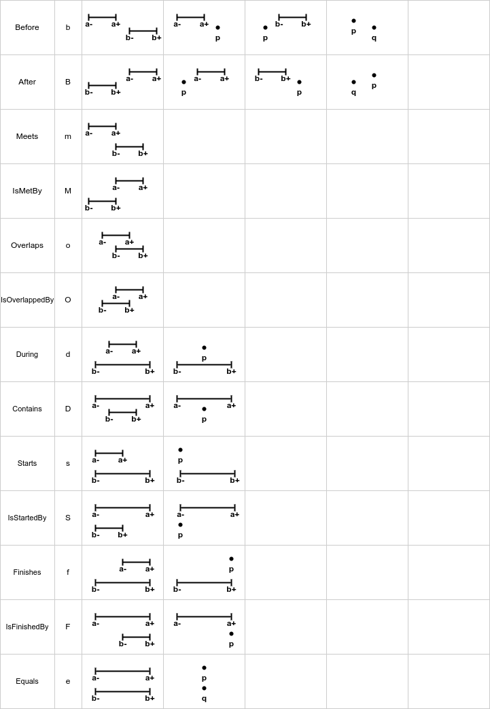

# mindthegap

Keywords: Allen’s Interval Algebra, Infinite Temporal Intervals, Temporal Knowledge Representation and Reasoning -- add them to git
Keywords: interval arithmetic, interval relations, hardware unit


> Intervals, Relations and Algorithms

- **Point-Point (PP)** relations between a pair of points.
- **Point-Interval (PI)** relations that between a point and an interval.
- **Interval-Interval (II)** relations that between a pair of intervals.

## Intervals

## Relations



- Before (b) / After (B)
- Meets (m) / IsMetBy (M)
- Overlaps (o) / IsOverlappedBy (O)
- During (d) / Contains (D)
- Starts (s) / IsStartedBy (S)
- Finishes (f) / IsFinishedBy (F)
- Equals (e)


```text
  Relation                  AAAAA
  before(a,b)      b|B      :   : BBBBBBBBB  |
  meets(a,b)       m|M      :   BBBBBBBBB    |  a+ = b-
  overlaps(a,b)    o|O      : BBBBBBBBB      |  a- < b- < a+ ; a+ < b+
  starts(a,b)      s|S      BBBBBBBBB        |  a- = b- ; a+ < b+
  during(a,b)      d|D    BBBBBBBBB          |  a- > b- ; a+ < b+
  finishes(a,b)    f|F  BBBBBBBBB            |  a+ = b+ ; a- > b-
  equals(a, b)     e        BBBBB            |  a- = b- ; a+ = b+
```

- IsSubset

```text
  is-subset                 AAAAA            |  a- >= b- ; a+ <= b+
                            :   :
  starts(a,b)      s        BBBBBBBBB
  during(a,b)      d      BBBBBBBBB
  finishes(a,b)    f    BBBBBBBBB
  equals(a, b)     e        BBBBB
```

## Algorithms


## Contact

[Grigorii Chudnov](mailto:g.chudnov@gmail.com)

## License

Distributed under the [The MIT License (MIT)](LICENSE).
