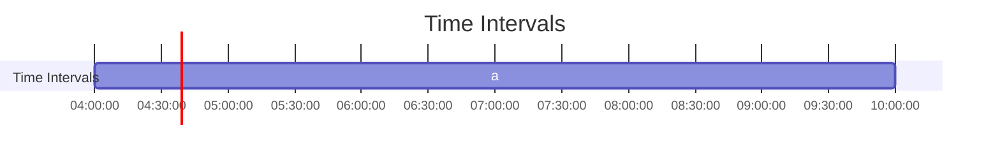

+++
draft = false
insert_anchor_links = "right"
+++

# Mind the Gap: Interval, Relations, and Algorithms Library

Welcome to the **Mind the Gap** documentation! This library provides a comprehensive set of tools to work with **intervals**, **relations**, and **algorithms**. Whether you're working with points, intervals, or need to apply advanced interval-based algorithms, this library has you covered.

## Key Features

- **Intervals**: Support for various types of intervals (open, closed, bounded, unbounded).
- **Relations**: Includes Allen's interval algebra, with 13 distinct relations between intervals.
- **Algorithms**: A rich set of algorithms to handle operations like intersection, union, gap calculation, grouping, and more.
- **Diagrams**: Generate diagrams to visualize intervals using ASCII or [Mermaid](https://mermaid.js.org/) notation.
- **Custom Domains**: Support for custom types and domains.

## Getting Started

To include this library in your Scala project, add the following dependency to your `build.sbt`:

```scala
libraryDependencies += "com.github.gchudnov" %% "mtg" % "{{APP_VERSION}}"

// Optional dependencies for diagram generation
libraryDependencies += "com.github.gchudnov" %% "mtg-diagram-ascii" % "{{APP_VERSION}}"   // ASCII diagrams
libraryDependencies += "com.github.gchudnov" %% "mtg-diagram-mermaid" % "{{APP_VERSION}}" // Mermaid diagrams
```

### Import the Library

Once the dependency is added, import the required packages into your project:

```scala
import com.github.gchudnov.mtg.*
import com.github.gchudnov.mtg.diagram.*
```

## Example: Intersection of Intervals

This library allows you to perform operations like intersection between intervals. Here’s a quick example:

```scala
val a = Interval.closed(0, 5) // [0,5]
val b = Interval.closed(1, 6) // [1,6]

val c = a.intersection(b) // [1,5]

println(c)
// Output: [1,5]
```

### Explore More

For more examples, including real-world use cases, check out the [examples directory](https://github.com/gchudnov/mindthegap/tree/main/examples/src/main/scala/com/github/gchudnov/examples).

## Documentation Overview

The documentation is divided into the following sections:

- **[Intervals](intervals/)**: Understand interval types, creation, operations, and more.
- **[Relations](relations/)**: Learn about relations between intervals, including basic and extended relations.
- **[Algorithms](algorithms/)**: Explore algorithms like intersection, union, gap, and advanced grouping techniques.

Each section contains detailed explanations, code examples, and diagrams to help you understand how to use the library effectively.

### Intervals Overview

Intervals are defined as pairs of points `{a-, a+}`, representing the start and end. They can be open, closed, bounded, or unbounded, and various operations can be performed on them.

To learn more, check out the [Intervals section](intervals/).

### Relations Overview

The library implements Allen's interval algebra, which defines 13 distinct relations between time intervals. Relations include _before_, _after_, _meets_, _overlaps_, and many more.

To dive deeper into relations, visit the [Relations section](relations/).

### Algorithms Overview

The library supports several key interval algorithms, such as intersection, span, union, and more advanced operations like grouping and splitting intervals.

For a deeper dive into interval algorithms, see the [Algorithms section](algorithms/).

## Diagram Support

Visualizing intervals is essential for understanding complex relations and operations. This library offers support for generating diagrams in both ASCII and Mermaid formats.

### ASCII Diagram Example

```scala
val a = Interval.closed(3, 7)
val b = Interval.closed(10, 15)

val renderer = AsciiRenderer.make[Int]()
val diagram = Diagram
  .empty[Int]
  .withSection { s =>
    List(a, b).zipWithIndex.foldLeft(s) { case (s, (i, k)) =>
      s.addInterval(i, s"${('a' + k).toChar}")
    }
  }

renderer.render(diagram)

println(renderer.result)
```

The output will look like this:

```text
  [*******]                          | [3,7]   : a
              [**********]           | [10,15] : b
--+-------+-----+-------+-----+---+ |
  3       7     10      15          |
```

### Mermaid Diagram Example

```scala
import java.time.*

val t1 = LocalTime.parse("04:00")
val t2 = LocalTime.parse("10:00")

val renderer = MermaidRenderer.make[LocalTime]
val diagram = Diagram
  .empty[LocalTime]
  .withSection { s =>
    val s0 = s.withTitle("Time Intervals")
    List(Interval.closed(t1, t2)).zipWithIndex.foldLeft(s0) { case (s, (i, k)) =>
      s.addInterval(i, s"${('a' + k).toChar}")
    }
  }

renderer.render(diagram)

println(renderer.result)
```

The output can be visualized using the [Mermaid Live Editor](https://mermaid.live):



## Further Resources

- **API Documentation**: Detailed API documentation is available to help you dive into the specifics of each class and method.
- **Contributing**: Want to contribute to this project? Check out the [contribution guidelines](https://github.com/gchudnov/mindthegap/blob/main/CONTRIBUTING.md) for more details.

If you have any questions, feel free to explore open an issue on GitHub.
