+++
title = "Algorithms"
description = "Algorithms"
date = 2024-09-03
draft = false

[extra]
+++

## Intersection

An _intersection_ `&` of two intervals `a` and `b` is the interval `c`, such that `c = a & b := [max(a-, b-), min(a+, b+)]`.
If two intervals do not intersect, the _intersection_ results in an empty interval.

```scala
val a = Interval.closed(5, 10) // [5, 10]
val b = Interval.closed(1, 7)  // [1, 7]

val c = a.intersection(b)      // [5, 7]
```


- **Commutative property**: `a & b = b & a` holds for any intervals `a` and `b`, meaning the order of the operands does not affect the result.
- **Associative property**: `(a & b) & c = a & (b & c)` holds for any intervals `a`, `b`, and `c`, meaning the order of operations does not affect the result.

## Span

A _span_ `#` of two intervals `a` and `b` is the interval `c`, such that `c = a # b := [min(a-, b-), max(a+, b+)]`.

```scala
val a = Interval.closed(5, 10) // [5, 10]
val b = Interval.closed(1, 7)  // [1, 7]

val c = a.span(b)              // [1, 10]
```


The resulting interval `c` covers the duration of both intervals `a` and `b`, even if they are disjoint:

```scala
val a = Interval.closed(1, 5)   // [1, 5]
val b = Interval.closed(7, 10)  // [7, 10]

val c = a.span(b)               // [1, 10]
```


- **Commutative property**: `a # b = b # a` holds for any intervals `a` and `b`.
- **Associative property**: `(a # b) # c = a # (b # c)` holds for any intervals `a`, `b`, and `c`.

## Union

A _union_ `∪` of two intervals `a` and `b` is the interval `c`, such that: `c = a ∪ b = [min(a-, b-), max(a+, b+)]` if `merges(a, b)`, and `∅` otherwise.

The operation is similar to _span_, but for the intervals to merge, they must be _adjacent_ or _intersecting_.

```scala
val a = Interval.closed(1, 5)  // [1, 5]
val b = Interval.closed(6, 10) // [6, 10]

val c = a.union(b)             // [1, 10]
```


If the intervals are _disjoint_ but _not adjacent_, the union is empty:

```scala
val a = Interval.closed(1, 4)  // [1, 4]
val b = Interval.closed(6, 10) // [6, 10]

val c = a.union(b)             // ∅
```


- **Commutative property**: `a ∪ b = b ∪ a` holds for any intervals `a` and `b`.

## Gap

A _gap_ `∥` between two intervals `a` and `b` is the interval `c`, such that: `c = a ∥ b := [succ(min(a+, b+)), pred(max(a-, b-))]`.

```scala
val a = Interval.closed(1, 4)   // [1, 4]
val b = Interval.closed(7, 10)  // [7, 10]

val c = a.gap(b)                // [5, 6]
```


If the intervals are not disjoint, the gap is empty:

```scala
val a = Interval.closed(5, 10) // [5, 10]
val b = Interval.closed(1, 7)  // [1, 7]

val c = a.gap(b)               // ∅
```


- **Commutative property**: `a ∥ b = b ∥ a` holds for any intervals `a` and `b`.

**Note:** _intersection_ and _gap_ operations are related: for any intervals `a` and `b`, `(a & b).swap == (a ∥ b).inflate`.

## Subtraction

In interval arithmetic, subtraction is used to find parts of one interval that do not overlap with another. This section covers three types of subtraction operations: `Minus`, `Complementary Difference`, and `Symmetric Difference`.

**Comparison of Subtraction Functions:**

| Operation                    | Output Type        | Behavior                                           |
| ---------------------------- | ------------------ | -------------------------------------------------- |
| **Minus**                    | Single interval    | Returns a single interval, throws if not possible. |
| **Complementary Difference** | Multiple intervals | Returns the disjoint portions of `a` outside `b`.  |
| **Symmetric Difference**     | Multiple intervals | Returns non-overlapping portions of `a` and `b`.   |

### Minus

`a.minus(b)` is a special form of subtraction where the result is guaranteed to be a single interval. This operation returns the part of `a` that lies outside `b` when `a` and `b` are disjoint or minimally overlap:

- `c := a - b = [a-, min(pred(b-), a+)]` if `a- < b-` and `a+ <= b+`;
- `c := a - b = [max(succ(b+), a-), a+]` if `a- >= b-` and `a+ > b+`.

`a.minus(b)` is defined if:

- `a` and `b` are _disjoint_;
- `a` contains either `b-` or `b+` but not both;
- either `b.starts(a)` or `b.finishes(a)`.

```scala
val a = Interval.closed(1, 10)  // [1, 10]
val b = Interval.closed(5, 15)  // [5, 15]

val c = a.minus(b)              // [1, 4]
```


```scala
val a = Interval.closed(5, 15) // [5, 15]
val b = Interval.closed(1, 10) // [1, 10]

val c = a.minus(b)             // [11, 15]
```


When `a.contains(b)`, the operation will throw an `UnsupportedOperationException`. Use `Intervals.difference(a, b)` instead. It returns a collection of intervals.

### Complementary Difference

The `Intervals.difference(a, b)` computes the portions of interval `a` that do not overlap with `b`. Unlike `Minus`, this function can return multiple disjoint intervals if necessary:

`c1, c2 := (a - b) = list([a-, pred(b-)], [succ(b+), a+])`.

```scala
val a = Interval.closed(1, 15)  // [1, 15]
val b = Interval.closed(5, 10)  // [5, 10]

val cs = Interval.difference(a, b)  // [[1, 4], [11, 15]]

// val c = a.minus(b)  // throws UnsupportedOperationException
```


### Symmetric Difference

The `Intervals.differenceSymmetric(a, b)` computes the intervals that are part of either `a` or `b` but not both. It finds the non-overlapping parts of both intervals.

```scala
val a = Interval.closed(1, 5)   // [1, 5]
val b = Interval.closed(3, 7)   // [3, 7]

val result = Interval.differenceSymmetric(a, b)  // [[1, 2], [6, 7]]
```


## Group

The _group_ operation takes a collection of intervals `[a1, a2, ... an]` and groups all the _adjacent_ or _intersecting_ ones, producing a new collection of intervals -- interval groups.

Methods:

- `Interval.group([a1, a2, ... an], isGroupAdjacent: Boolean = true)` returns a collection of grouped intervals: `[g1, g2, ... gn]`.
- `Interval.groupFind([a1, a2, ... an], isGroupAdjacent: Boolean = true)` returns a collection of tuples `[(g1, {i, ... }), (g2, {j, ... }), ... (gn, {k, ... })]`, where `gk` is the grouped interval and `{i, ... }` is a set of indices of intervals that were grouped.

The resulting collection of intervals is:

- _disjoint_, with no overlapping intervals;
- contains no _adjacent_ intervals if `isGroupAdjacent` is set to `false`;
- sorted.

```scala
val a = Interval.closed(0, 10)  // [0, 10]
val b = Interval.closed(3, 50)  // [3, 50]
val c = Interval.closed(20, 30) // [20, 30]

val d = Interval.closed(60, 70) // [60, 70]
val e = Interval.closed(71, 80) // [71, 80]

val input = List(a, b, c, d, e)
//    indices:   0  1  2  3  4

// isGroupAdjacent = true
val gs = Interval.group(input)
// [ [0, 50], [60, 80] ]

val ts = Interval.groupFind(input)
// [ ([0, 50], {0, 1, 2}), ([60, 80], {3, 4}) ]


// isGroupAdjacent = false
val gs = Interval.group(input, false)
// [ [0, 50], [60, 70], [71, 80] ]

val ts = Interval.groupFind(input, false)
// [ ([0, 50], {0, 1, 2}), ([60, 70], {3}), ([71, 80], {4}) ]
```

**isGroupAdjacent = true:**


**isGroupAdjacent = false:**


## Complement

_Complement_ is a collection of gaps between grouped intervals `[a1, a2, ... an]`.

```scala
val a = Interval.closed(0, 10)  // [0, 10]
val b = Interval.closed(5, 20)  // [5, 20]
val c = Interval.closed(25, 30) // [25, 30]
val d = Interval.closed(35, 40) // [35, 40]

val input = List(a, b, c, d)

val is = Interval.complement(input)
// [ (-∞, -1], [21, 24], [31, 34], [41, +∞) ]
```


## Split

_Split_ divides intervals into a collection of adjacent intervals, sorted in sequence.

Methods:

- `Interval.split([a1, a2, ... an])` takes a collection of intervals and returns a collection of splits `[s1, s2, ... sn]`.
- `Interval.splitFind([a1, a2, ... an])` takes a collection of intervals and returns a collection of tuples `[(s1, {i, ... }), (s2, {j, ... }), ... (sn, {k, ... })]`, where `sk` is the split-interval and `{i, ... }` is a set of indices of input intervals that belong to `sk`.

```scala
val a = Interval.closed(0, 20)  // [0, 20]
val b = Interval.closed(10, 30) // [10, 30]
val c = Interval.closed(40, 50) // [40, 50]

val input = List(a, b, c)

val ss = Interval.split(input)
// [ [0, 9], [10, 20], [21, 30], [31, 39], [40, 50] ]

val gs = Interval.splitFind(input)
// [ ([0, 9], {0}), ([10, 20], {0, 1}), ([21, 30], {1}), ([31, 39], {}), ([40, 50], {2}) ]
```


