+++
title = "Algorithms"
description = "Algorithms"
date = 2022-11-19
draft = false

[extra]
+++

## Intersection

An _intersection_ `&` of two intervals `a` and `b` is the interval `c`, such that `c = a & b := [max(a-, b-), min(a+, b+)]`.
When two intervals are not intersecting, the _intersection_ produces an empty-interval.

```scala
val a = Interval.closed(5, 10) // [5, 10]
val b = Interval.closed(1, 7)  // [1, 7]

val c = a.intersection(b)      // [5, 7]
```


- **Commutative property**: `a & b = b & a` holds for _any_ intervals `a` and `b`. It means that changing the _order of the operands_ does not change the result.
- **Associative property**: `(a & b) & c = a & (b & c)` holds _for_ any intervals `a`, `b` and `c`. It means that _order of operations_ does not affect the result.

## Span

A _span_ `#` of two intervals `a` and `b` is the interval `c`, such shat `c = a # b := [min(a-, b-), max(a+, b+)]`.

```scala
val a = Interval.closed(5, 10) // [5, 10]
val b = Interval.closed(1, 7)  // [1, 7]

val c = a.span(b)              // [1, 10]
```


The resulting interval `c` covers the duration of both intervals `a` and `b` even if they are disjoint:

```scala
val a = Interval.closed(1, 5)   // [1, 5]
val b = Interval.closed(7, 10)  // [7, 10]

val c = a.span(b)               // [1, 10]
```


- **Commutative property**: `a # b = b # a` holds for _any_ intervals `a` and `b`. It means that changing the _order of the operands_ does not change the result.
- **Associative property**: `(a # b) # c = a # (b # c)` holds _for_ any intervals `a`, `b` and `c`. It means that _order of operations_ does not affect the result.

## Union

A _union_ `∪` of two intervals `a` and `b` is the interval `c`, such that: `c = a ∪ b = [min(a-,b-), max(a+,b+)] if merges(a, b)` and `∅` otherwise.

The operation is similar to _span_, but in order to be merged, the intervals should be _adjacent_ or _intersecting_.

```scala
val a = Interval.closed(1, 5)  // [1, 5]
val b = Interval.closed(6, 10) // [6, 10]

val c = a.union(b)             // [1, 10]
```


If the intervals are _disjoint_ but _not adjacent_, the union is empty:

```scala
val a = Interval.closed(1, 4)  // [1, 4]
val b = Interval.closed(6, 10) // [6, 10]

val c = a.union(b)             // ∅
```


- **Commutative property**: `a ∪ b = b ∪ a` holds for _any_ intervals `a` and `b`. It means that changing the _order of the operands_ does not change the result.

## Gap

A _gap_ `∥` between two intervals `a` and `b` is the interval `c`, such that: `c = a ∥ b := [succ(min(a+, b+)), pred(max(a-, b-))]`.

```scala
val a = Interval.closed(1, 4)   // [1, 4]
val b = Interval.closed(7, 10)  // [7, 10]

val c = a.gap(b)                // [5, 6]
```


If the intervals are not disjoint, the gap is empty.

```scala
val a = Interval.closed(5, 10) // [5, 10]
val b = Interval.closed(1, 7)  // [1, 7]

val c = a.gap(b)                // ∅
```



- **Commutative property**: `a ∥ b = b ∥ a` holds for _any_ intervals `a` and `b`. It means that changing the _order of the operands_ does not change the result.

**NOTE:** _intersection_ and _gap_ operations are related: for _any_ intervals `a` and `b`, `(a & b).swap == (a ∥ b).inflate`.

## Minus

Subtraction `-` of two intervals, `a` _minus_ `b` is the interval `c`, such that:

- `c := a - b = [a-, min(pred(b-), a+)]` if `a- < b-` and `a+ <= b+`;
- `c := a - b = [max(succ(b+), a-), a+]` if `a- >= b-` and `a+ > b+`.

`a.minus(b)` is defined if and only if:

- `a` and `b` are _disjoint_;
- `a` _contains_ either `b-` or `b+` but not both;
- either `b.starts(a)` or `b.finishes(a)` is true.

`a.minus(b)` is undefined if:

- either `a.starts(b)` or `a.finishes(b)`;
- either `a` or `b` is _properly included_ in the other.
  - NOTE: when `a.contains(b)`, use `Intervals.minus(a, b)` instead, it returns a collection of intervals.

```scala
val a = Interval.closed(1, 10)  // [1, 10]
val b = Interval.closed(5, 15)  // [5, 15]

val c = a.minus(b)              // [1, 4]
```


```scala
val a = Interval.closed(5, 15) // [5, 15]
val b = Interval.closed(1, 10) // [1, 10]

val c = a.minus(b)             // [11, 15]
```


**NOTE:** the operation `a.minus(b)` is not defined if `a.contains(b)` and throws `UnsupportedOperationException`.
Use `Intervals.minus(a, b)` instead that returns a collection of intervals: `c1, c2 := a - b = list([a-, pred(b-)], [succ(b+), a+])`

```scala
val a = Interval.closed(1, 15)  // [1, 15]
val b = Interval.closed(5, 10)  // [5, 10]

// val c = a.minus(b)           // throws UnsupportedOperationException
val cs = Interval.minus(a, b)   // [[1, 4], [11, 15]]
```


