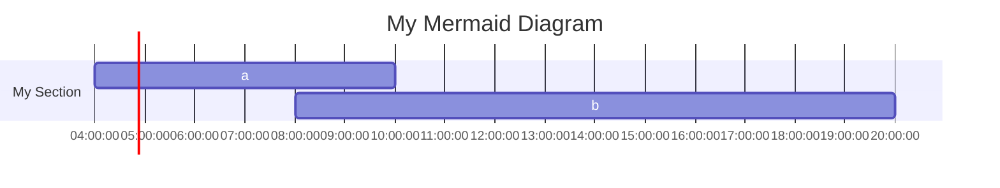

+++
title = "Intervals"
description = "Intervals"
date = 2024-09-03
draft = false

[extra]
+++

## Intervals

An **interval** defined by a pair `{a-, a+}`, that represent a starting `a-` and ending `a+` values on a discrete linear infinite domain `D`.
Interval is a _convex_ set that contains all elements between `a-` and `a+`.


For each element of the domain `D`, there is only one _successor_ and _predecessor_ and no other elements in-between.

A pair `{a-, a+} ∈ D × D` corresponds to a point on a two-dimensional plane.

Given _successor_, `succ()` and _predecessor_, `pred()` functions that allow to get the next and the previous element, we can define different types of intervals as closed intervals:

- closed interval `[a-, a+]` is represented as-is `[a-, a+]`
- right-open interval`[a-, a+)` is represented as `[a-, pred(a+)]`
- left-open interval `(a-, a+]` is represented as `[succ(a-), a+]`
- open interval `(a-, a+)` is represented as `[succ(a-), pred(a+)]`

We consider an interval to be in a _canonical_ form when it is represented as a closed interval.

## Classification

A pair `{a-, a+}` represents a _non-empty_ interval if `a- ≤ a+`; otherwise, the interval is _empty_.
If left boundary `a-` is equal to the right boundary, `a+` (consists of a single value only), we call it as a _degenerate_ interval or a _point_.
A non-empty interval is _proper_ if left boundary is less than the right boundary `a- < a+`.

A _proper_ interval is _bounded_, if it is both left- and right-bounded; and _unbounded_ otherwise.

On the diagram above, _proper_ intervals represented as points _above_ the line `a+ = a-`, _point_ intervals
are located on the line `a+ = a-` and all empty intervals are _below_ the line `a+ = a-`.

- empty : `a- > a+`
- point : `{x} = {x | a- = x = a+}`
- proper : `a- < a+`
  - bounded
    - open : `(a-, a+) = {x | a- < x < a+}`
    - closed : `[a-, a+] = {x | a- <= x <= a+}`
    - left-closed, right-open : `[a-, a+) = {x | a- <= x < a+}`
    - left-open, right-closed : `(a-, a+] = {x | a- < x <= a+}`
  - left-bounded, right-unbounded
    - left-open : `(a-, +∞) = {x | x > a-}`
    - left-closed : `[a-, +∞) = {x | x >= a-}`
  - left-unbounded, right-bounded
    - right-open : `(-∞, a+) = {x | x < a+}`
    - right-closed : `(-∞, a+] = {x | x < a+}`
  - unbounded : `(-∞, +∞)`

## Creation

To create an interval one of the factory methods can be used:

```scala
import com.github.gchudnov.mtg.*

Interval.empty[Int]                 // ∅ = (+∞, -∞)
Interval.point(5)                   // {5}
Interval.open(1, 5)                 // (1, 5)
Interval.closed(1, 5)               // [1, 5]
Interval.leftClosedRightOpen(1, 5)  // [1, 5)
Interval.leftOpenRightClosed(1, 5)  // (1, 5]
Interval.leftOpen(1)                // (1, +∞)
Interval.leftClosed(5)              // [5, +∞)
Interval.rightOpen(1)               // (-∞, 1)
Interval.rightClosed(5)             // (-∞, 5]
Interval.unbounded[Int]             // (-∞, +∞)

Interval.open(Some(1), Some(5))     // (1, 5)
Interval.open(Some(1), None)        // (1, +∞)
Interval.open(None, Some(5))        // (-∞, 5)
Interval.open(None, None)           // (-∞, +∞)

Interval.closed(Some(1), Some(5))   // [1, 5]
Interval.closed(Some(1), None)      // [1, +∞)
Interval.closed(None, Some(5))      // (-∞, 5]
Interval.closed(None, None)         // (-∞, +∞)
```

## Operations

Given an interval `a`,

`a.isEmpty`, `a.isPoint`, `a.isProper` (`a.nonEmpty`, `a.nonPoint`, `a.nonProper`) can be used to check the type of an interval.

```scala
Interval.open(1, 5).isEmpty  // false
Interval.open(1, 5).isProper // true
Interval.open(1, 5).isPoint  // false
```

### Canonical

`a.canonical` produces the canonical form of an interval where left and right boundaries are _closed_.

A _canonical_ form of a closed interval is the interval itself.

```scala
Interval.open(1, 5).canonical   // (1, 5) -> [2, 4]
Interval.closed(1, 5).canonical // [1, 5] -> [1, 5]
```

### Swap

`a.swap` swaps left and right boundary, to convert a _non-empty_ interval to an _empty_ interval or vice versa.

```scala
Interval.closed(1, 5).swap // [1, 5] -> [5, 1]
```



### Inflate

`a.inflate` inflates an interval, extending its size: `[a-, a+] -> [pred(a-), succ(a+)]`.

```scala
Interval.closed(1, 2).inflate // [1, 2] -> [0, 3]
```



In addition, `a.inflateLeft` and `a.inflateRight` methods extend left and right boundaries of an interval.

### Deflate

`a.deflate` deflates an interval, reducing its size: `[a-, a+] -> [succ(a-), pred(a+)]`.

NOTE: it is possible that after deflation an interval becomes _empty_.

```scala
Interval.closed(1, 2).deflate // [1, 2] -> [2, 1]
```



In addition, `a.deflateLeft` and `a.deflateRight` methods shrink left and right boundaries of an interval.

## Show

Use `.toString` to represent an interval in a human-readable form:

```scala
val a = Interval.empty[Int]
val b = Interval.point(5)
val c = Interval.proper(None, true, Some(2), false)

a.toString // ∅
b.toString // {5}
c.toString // [-∞,2)
```

## Display

A collection of intervals can be displayed, using ASCII or [Mermaid](https://mermaid.js.org/) diagrams.

### ASCII

```scala
import com.github.gchudnov.mtg.*
import com.github.gchudnov.mtg.diagram.*

val a = Interval.closed(3, 7)
val b = Interval.closed(10, 15)
val c = Interval.closed(12, 20)

val renderer = AsciiRenderer.make[Int]()
val diagram = Diagram
  .empty[Int]
  .withSection { s =>
    List(a, b, c).zipWithIndex.foldLeft(s) { case (s, (i, k)) =>
      s.addInterval(i, s"${('a' + k).toChar}")
    }
  }

renderer.render(diagram)

println(renderer.result)
```

Produces the following output:

```text
  [*******]                              | [3,7]   : a
                [**********]             | [10,15] : b
                     [***************]   | [12,20] : c
--+-------+-----+----+-----+---------+-- |
  3       7    10   12    15        20   |
```

### Mermaid

Only Date/Time intervals are supported for Mermaid diagrams.

```scala
val t1 = LocalTime.parse("04:00")
val t2 = LocalTime.parse("10:00")
val t3 = LocalTime.parse("08:00")
val t4 = LocalTime.parse("20:00")

val a = Interval.closed(t1, t2)
val b = Interval.closed(t3, t4)

val renderer = MermaidRenderer.make[LocalTime]
val diagram = Diagram
  .empty[LocalTime]
  .withTitle("My Mermaid Diagram")
  .withSection { s =>
    val s0 = s.withTitle("My Section")
    List(a, b).zipWithIndex.foldLeft(s0) { case (s, (i, k)) =>
      s.addInterval(i, s"${('a' + k).toChar}")
    }
  }

renderer.render(diagram)

println(renderer.result)
```

That produces the mermaid diagram:



It can be rendered using the [Mermaid Live Editor](https://mermaid.live/).

### View

`View` is used to specify a range `[from, to]` to display. When not explicitly provided, a view that includes all of the intervals is used.

For the example above, when view `[8, 17]` is specified:

```scala
val view    = View(Some(8), Some(17))
val diagram = Diagram.make(List(a, b, c), view)
```

it will produce the following diagram when rendering:

```text
                                         | [3,7]   : a
          [******************]           | [10,15] : b
                  [********************* | [12,20] : c
--+-------+-------+----------+-------+-- |
  8      10      12         15      17   |
```

Here we can see that the interval `[3,7]` is not in the view and only part of the interval `[12,20]` is displayed.

### Canvas

`Canvas` specifies the _width_ of the text buffer to draw a diagram on. When not provided, a default canvas of width `40` is used.

For example, when a custom canvas of width `20` is used:

```scala
val canvas = Canvas.make(20)
val diagram = Diagram.make(List(a, b, c), canvas)
```

will produce:

```text
  [***]              | [3,7]   : a
        [****]       | [10,15] : b
          [******]   | [12,20] : c
--+---+-+-+--+---+-- |
  3   7  12 15  20   |
```

### Theme

A custom theme could be specified when rendering a diagram and used to set the interval styles, specify whether to show legend, annotations and how to display labels.

For example, on the diagram above, not all labels are visible, since it is not enough place on one line to display them non-overlapping.
To display all labels, a custom theme can be applied:

```scala
val theme = Theme.default.copy(label = Theme.Label.Stacked)
Diagram.render(diagram, theme)
```

that produces the following output:

```text
  [***]              | [3,7]   : a
        [****]       | [10,15] : b
          [******]   | [12,20] : c
--+---+-+-+--+---+-- |
  3   7  12 15  20   |
       10            |
```

Here we can see that labels are displayed on several lines, including the missing label, `10`.

## Domain

To work with intervals, a `given` instance of `Domain[T]` is needed. It is provided by default for _integral_ types. For other types, a set of factory methods is provided to create a `Domain[T]` instance:

- `Domain.makeFractional[T: Fractional](unit: T): Domain[T]`
- `Domain.makeOffsetDateTime(unit: TemporalUnit): Domain[OffsetDateTime]`
- `Domain.makeOffsetTime(unit: TemporalUnit): Domain[OffsetTime]`
- `Domain.makeLocalDateTime(unit: TemporalUnit): Domain[LocalDateTime]`
- `Domain.makeLocalDate(unit: TemporalUnit): Domain[LocalDate]`
- `Domain.makeLocalTime(unit: TemporalUnit): Domain[LocalTime]`
- `Domain.makeZonedDateTime(unit: TemporalUnit): Domain[ZonedDateTime]`
- `Domain.makeInstant(unit: TemporalUnit): Domain[Instant]`

`Domain[T]` is defined as:

```scala
trait Domain[T] extends Ordering[T]:
  def succ(x: T): T
  def pred(x: T): T
  def count(start: T, end: T): Long
```

where `succ(x)` and `pred(x)` are used to get the next and previous value of `x`; `count` - to return the length (duration) of an interval, where _start_ and _end_ points are inclusive: `[start, end]`.

## Ordering

Intervals can be ordered:

- if `a- < b+` then `a < b`
- if `a- == b+` then
  - if `a+ < b+` then `a < b`
  - if `a+ == b+` then `a == b`
  - else `a > b`
- else `a > b`

```scala
val a = Interval.closed(0, 10)   // [0, 10]
val b = Interval.closed(20, 30)  // [20, 30]

List(b, a).sorted // List(a, b)  // [0, 10], [20, 30]
```
