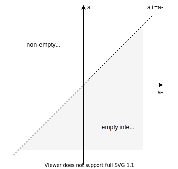

+++
title = "Intervals"
description = "Intervals"
date = 2022-11-19
draft = false

[extra]
+++

## Intervals

An **interval** defined by a pair `{a-, a+}`, that represent a starting `a-` and ending `a+` values on a discrete linear infinite domain `D`.
Interval is a _convex_ set that contains all elements between `a-` and `a+`.



For each element of the domain `D`, there is only one _successor_ and _predecessor_ and no other elements in-between.

A pair `{a-, a+} ∈ D × D` corresponds to a point on a two-dimensional plane.

Given _successor_, `succ()` and _predecessor_, `pred()` functions that allow to get the next and the previous element, we can define different types of intervals as closed intervals:

- closed interval `[a-, a+]` is represented as-is `[a-, a+]`
- right-open interval`[a-, a+)` is represented as `[a-, pred(a+)]`
- left-open interval `(a-, a+]` is represented as `[succ(a-), a+]`
- open interval `(a-, a+)` is represented as `[succ(a-), pred(a+)]`

We consider an interval to be in a _canonical_ form when it is represented as a closed interval.

## Classification

A pair `{a-, a+}` represents a _non-empty_ interval if `a- ≤ a+`; otherwise, the interval is _empty_.
If left boundary `a-` is equal to the right boundary, `a+` (consists of a single value only), we call it as a _degenerate_ interval or a _point_.
A non-empty interval is _proper_ if left boundary is less than the right boundary `a- < a+`.

A _proper_ interval is _bounded_, if it is both left- and right-bounded; and _unbounded_ otherwise.

On the diagram above, _proper_ intervals represented as points _above_ the line `a+ = a-`, _point_ intervals
are located on the line `a+ = a-` and all empty intervals are _below_ the line `a+ = a-`.

- empty : `a- > a+`
- point : `{x} = {x | a- = x = a+}`
- proper : `a- < a+`
  - bounded
    - open : `(a-, a+) = {x | a- < x < a+}`
    - closed : `[a-, a+] = {x | a- <= x <= a+}`
    - left-closed, right-open : `[a-, a+) = {x | a- <= x < a+}`
    - left-open, right-closed : `(a-, a+] = {x | a- < x <= a+}`
  - left-bounded, right-unbounded
    - left-open : `(a-, +∞) = {x | x > a-}`
    - left-closed : `[a-, +∞) = {x | x >= a-}`
  - left-unbounded, right-bounded
    - right-open : `(-∞, a+) = {x | x < a+}`
    - right-closed : `(-∞, a+] = {x | x < a+}`
  - unbounded : `(-∞, +∞)`

## Creation

To create an interval one of the factory methods can be used:

```scala
import com.github.gchudnov.mtg.*

Interval.empty[Int]                 // ∅ = (+∞, -∞)
Interval.point(5)                   // {5}
Interval.open(1, 5)                 // (1, 5)
Interval.closed(1, 5)               // [1, 5]
Interval.leftClosedRightOpen(1, 5)  // [1, 5)
Interval.leftOpenRightClosed(1, 5)  // (1, 5]
Interval.leftOpen(1)                // (1, +∞)
Interval.leftClosed(5)              // [5, +∞)
Interval.rightOpen(1)               // (-∞, 1)
Interval.rightClosed(5)             // (-∞, 5]
Interval.unbounded[Int]             // (-∞, +∞)
```

A special factory low-level method, `Interval.make` can be used to create an interval by providing boundaries.

```scala
Interval.make(Mark.at(0), Mark.pred(0))   // [0, 0)
Interval.make(Mark.succ(3), Mark.pred(5)) // (3, 5)
```

## Operations

Given an interval `a`,

`a.isEmpty`, `a.isPoint`, `a.isProper` (`a.nonEmpty`, `a.nonPoint`, `a.nonProper`) can be used to check the type of an interval.

```scala
Interval.open(1, 5).isEmpty  // false
Interval.open(1, 5).isProper // true
Interval.open(1, 5).isPoint  // false
```

`a.canonical` produces the canonical form of an interval where left and right boundaries are closed.

```scala
Interval.open(1, 5).canonical   // (1, 5) -> [2, 4]
Interval.closed(1, 5).canonical // [1, 5] -> [1, 5]
```

`a.normalize` optimizes the internal representation of an interval, reducing the amount of consecutive _succ()_ and _pred()_ markers.

```scala
Interval.make(Mark.pred(Mark.pred(1)), Mark.at(5)).normalize
// [pred(pred(1)), 5] -> [-1, 5]

Interval.make(Mark.succ(Mark.succ(1)), Mark.at(5)).normalize
// [succ(succ(1)), 5] -> [succ(2), 5] = (2, 5]
```

`a.swap` swaps left and right boundary, e.g. to convert an _empty_ to _non-empty_ interval or vice versa.

```scala
Interval.closed(1, 5).swap // [1, 5] -> [5, 1]
```

`a.inflate` inflates an interval, extending its size.

```scala
Interval.closed(1, 2).inflate // [1, 2] -> [0, 3]
```

In addition, `a.inflateLeft` and `a.inflateRight` methods extend left and right boundaries of an interval.

`a.deflate` deflates an interval, reducing its size.

```scala
Interval.closed(1, 2).deflate // [1, 2] -> [2, 1]
```

In addition, `a.deflateLeft` and `a.deflateRight` methods shrink left and right boundaries of an interval.

## Show

Import `Show.given` to pretty-print an interval:

```scala
import com.github.gchudnov.mtg.Show.given

val a = Interval.empty[Int]
val b = Interval.point(5)
val c = Interval.proper(None, true, Some(2), false)

a.show // ∅
b.show // {5}
c.show // [-∞,2)
```

## Display

A collection of intervals can be displayed:

```scala
val a = Interval.closed(3, 7)
val b = Interval.closed(10, 15)
val c = Interval.closed(12, 20)

val diagram = Diagram.make(List(a, b, c))

Diagram.render(diagram)
// List[String]
```

When printed, it produces the following output:

```text
  [*******]                              | [3,7]
                [**********]             | [10,15]
                     [***************]   | [12,20]
--+-------+-----+----+-----+---------+-- |
  3       7    10   12    15        20   |
```

Adjust the output by specifying custom `View`, `Canvas` and `annotations` during diagram creation and `Theme` when rendering:

```scala
Diagram.make(
  intervals: List[Interval[T]],
  view: View[T],            // View.default[T]
  canvas: Canvas,           // Canvas.default
  annotations: List[String] // List.empty[String]
): Diagram

Diagram.render(
  d: Diagram,
  theme: Theme // Theme.default
): List[String]
```

### View

`View` is used to specify a range `[from, to]` to display. When not explicitly provided, a view that includes all of the intervals is used.

For the example above, when view `[8, 17]` is specified:

```scala
val view    = View(Some(8), Some(17))
val diagram = Diagram.make(List(a, b, c), view)
```

it will produce the following diagram when rendering:

```text
                                         | [3,7]
          [******************]           | [10,15]
                  [********************* | [12,20]
--+-------+-------+----------+-------+-- |
  8      10      12         15      17   |
```

Here we can see that the interval `[3,7]` is not in the view and only part of the interval `[12,20]` is displayed.

### Canvas

`Canvas` specifies the _width_ of the text buffer to draw a diagram on. When not provided, a default canvas of width `40` is used.

For example, when a custom canvas of width `20` is used:

```scala
val canvas = Canvas.make(20)
val diagram = Diagram.make(List(a, b, c), canvas)
```

will produce:

```text
  [***]              | [3,7]
        [****]       | [10,15]
          [******]   | [12,20]
--+---+-+-+--+---+-- |
  3   7  12 15  20   |
```

### Theme

A custom theme could be specified when rendering a diagram and used to set the interval styles, specify whether to show legend, annotations and how to display labels.

For example, on the diagram above, not all labels are visible, since it is not enough place on one line to display them non-overlapping.
To display all labels, a custom theme can be applied:

```scala
val theme = Theme.default.copy(label = Theme.Label.Stacked)
Diagram.render(diagram, theme)
```

that produces the following output:

```text
  [***]              | [3,7]
        [****]       | [10,15]
          [******]   | [12,20]
--+---+-+-+--+---+-- |
  3   7  12 15  20   |
       10            |
```

Here we can see that labels are displayed on several lines, including the missing label, `10`.

## Domain

To work with intervals, a `given` instance of `Domain[T]` is needed.

`Domain[T]` is defined as:

```scala
trait Domain[T] extends Ordering[T]:
  def succ(x: T): T
  def pred(x: T): T
  def count(start: T, end: T): Long

```

where `succ(x)` and `pred(x)` are used to get the next and previous value of `x`; `count` - to return the length (duration) of an interval.

By default `Domain[T]` is implemented for _integral_ types (e.g. `Int`, `Long`) and date-time types `OffsetDateTime`, and `Instant`.

## Ordering

Intervals can be ordered.

```scala
val a = Interval.closed(0, 10)   // [0, 10]
val b = Interval.closed(20, 30)  // [20, 30]

List(b, a).sorted // List(a, b)  // [0, 10], [20, 30]
```
