+++
title = "Relations"
description = "Relations"
date = 2022-11-19
draft = false

[extra]
+++

## Basic Relations

The library supports relations between points, points and intervals & relations between intervals (famous [Allen's interval algebra](https://www.ics.uci.edu/~alspaugh/cls/shr/allen.html)).

- **Point-Point (PP)** relations between a pair of points.
- **Point-Interval (PI)** relations that between a point and an interval.
- **Interval-Interval (II)** relations that between a pair of intervals.

In Allen's interval algebra there are 13 basic relations between time intervals; these relations are distinct, exhaustive, and qualitative:

- **Distinct** because no pair of definite intervals can be related by more than one of the relationships.
- **Exhaustive** because any pair of definite intervals are described by one of the relations.
- **Qualitative** because no specific time spans are considered.

13 basic relations can be split in 6 pairs of _converse_ relations and one relation that converse to itself.
For example `a` _before_ `b` and `b` _after_ `a` is a pair of converse relations.
Whenever the first relation is _true_, the converse relation is _true_ as well.

For convenience, each relation has an associated symbol with it, e.g. `b` for the relation _before_.
The converse relation is represented by the same symbol, but in the upper case, e.g. `B` for the relation _after_, that is a converse of _before_, `b`.

Note, that the relations are defined on _non-empty_ intervals.


or can be represented in the following compact text form:

```text
  Relation         Symbol          AAAAA
                                   :   :
  a.before(b)         b            :   : BBBBBBBBB  | a+ < b-
  a.meets(b)          m            :   BBBBBBBBB    | a+ = b-
  a.overlaps(b)       o            : BBBBBBBBB      | a- < b- < a+ < b+
  a.starts(b)         s            BBBBBBBBB        | a- = b- ; a+ < b+
  a.during(b)         d          BBBBBBBBB          | a- > b- ; a+ < b+
  a.finishes(b)       f        BBBBBBBBB            | a+ = b+ ; a- > b-
  a.after(b)          B  BBBBBBBBB :   :            | a- > b+
  a.isMetBy(b)        M    BBBBBBBBB   :            | a- = b+
  a.isOverlappedBy(b) O      BBBBBBBBB :            | b- < a- < b+ < a+
  a.isStartedBy(b)    S            BBB :            | a- = b- ; b+ < a+
  a.contains(b)       D            : B :            | a- < b- ; b+ < a+
  a.isFinishedBy(b)   F            : BBB            | a+ = b+ ; a- < b-
  a.equalsTo(b)       e            BBBBB            | a- = b- ; a+ = b+
```

### Before / After

`a` _before_ `b` means that interval `a` ends _before_ interval `b` begins, with a gap separating them.
The converse relation is `b` _after_ `a`.

Condition: `a+ < b-`


```scala
// before (b), after (B)
Interval.closed(1, 4).before(Interval.closed(5, 8)) // true
Interval.closed(5, 8).after(Interval.closed(1, 4))  // true
```

### Meets / IsMetBy

`a` _meets_ `b` means that `b` begins at the same point where `a` ends.
The converse of relation is `b` _is met by_ `a`.

Condition: `a+ = b-`


```scala
// meets (m), isMetBy (M)
Interval.closed(1, 5).meets(Interval.closed(5, 10))   // true
Interval.closed(5, 10).isMetBy(Interval.closed(1, 5)) // true
```

### Overlaps / IsOverlappedBy

`a` _overlaps_ `b` when right boundary of the interval `a` is inside of the interval `b`.
The converse of relation is `b` _is overlapped by_ `a`.

Condition: `a- < b- < a+ < b+`


```scala
// overlaps (o), isOverlappedBy (O)
Interval.closed(1, 10).overlaps(Interval.closed(5, 15))       // true
Interval.closed(5, 15).isOverlappedBy(Interval.closed(1, 10)) // true
```

### Starts / IsStartedBy

`a` _starts_ `b` when both intervals `a` and `b` have the same left boundary, and interval `a` is inside an the interval `b`, however not equal to it.
The converse of relation is `b` _is started by_ `a`.

Condition: `a- = b- ; a+ < b+`


```scala
// starts (s), isStartedBy (S)
Interval.closed(1, 4).starts(Interval.closed(1, 6))      // true
Interval.closed(1, 6).isStartedBy(Interval.closed(1, 4)) // true
```

### During / Contains

`a` _during_ `b` when the interval `a` lies inside of the interval `b`.
The converse of relation is `b` _contains_ `a`.

Condition: `a- > b- ; a+ < b+`


```scala
// during (d), contains (D)
Interval.closed(3, 7).during(Interval.closed(1, 10))   // true
Interval.closed(1, 10).contains(Interval.closed(3, 7)) // true
```

### Finishes / IsFinishedBy

`a` _finishes_ `b` when both intervals `a` and `b` have the same right boundary, and interval `a` is inside an the interval `b`, however not equal to it.
The converse of relation is `b` _is finished by_ `a`.

Condition: `a+ = b+ ; a- > b-`


```scala
// finishes (f), isFinishedBy (F)
Interval.closed(3, 6).finishes(Interval.closed(1, 6))     // true
Interval.closed(1, 6).isFinishedBy(Interval.closed(3, 6)) // true
```

### EqualsTo

`a` _equals to_ `b` when the left and right boundaries of the intervals `a` and `b` are matching. It is its own converse.

Condition: `a- = b- ; a+ = b+`


```scala
// equalsTo (e)
Interval.closed(1, 5).equalsTo(Interval.closed(1, 5)) // true
```

## Extended Relations

For convenience the library defines extended relations that are composed of several basic relations.

### IsSubset

`a` is a _subset of_ `b` when the interval `a` _starts_, _during_, _finishes_ or _equals to_ the interval `b`.

Condition: `a- >= b- ; a+ <= b+`


```scala
Interval.closed(4, 7).isSubset(Interval.closed(4, 10)) // true
Interval.closed(4, 7).isSubset(Interval.closed(2, 10)) // true
Interval.closed(4, 7).isSubset(Interval.closed(2, 7))  // true
Interval.closed(4, 7).isSubset(Interval.closed(4, 7))  // true
```

### IsSuperset

`a` is a _superset of_ `b` when the interval `a` _is started by_, _contains_, _is finished by_ or _equals to_ `b`.

Condition: `b- >= a- ; b+ <= a+`


```scala
Interval.closed(4, 10).isSuperset(Interval.closed(4, 7)) // true
Interval.closed(2, 10).isSuperset(Interval.closed(4, 7)) // true
Interval.closed(2, 7).isSuperset(Interval.closed(4, 7))  // true
Interval.closed(4, 7).isSuperset(Interval.closed(4, 7))  // true
```

### IsDisjoint

`a` and `b` are _disjoint_ if `a` does not intersect `b`. It means `a` _before_ `b` or `a` _after_ `b`.

Condition: `a+ < b- OR a- > b+`



```scala
Interval.closed(5, 7).isDisjoint(Interval.closed(1, 3))  // true
Interval.closed(5, 7).isDisjoint(Interval.closed(8, 10)) // true
```

### IsAdjacent

Two intervals `a` and `b` are _adjacent_ if they are _disjoint_ and the successor of the right boundary of `a` equals to the left boundary of `b` or
the successor of the right boundary of `b` equals to the left boundary of `a`.

Condition: `succ(a+) = b- OR succ(b+) = a-`.


```text
  a.isAdjacent(b)                  AAAAA            |  succ(a+) = b- OR succ(b+) = a-
                                   :   :
  a.before(b)         b            :   : BBBBBBBBB  | a+ < b- ; succ(a+) = b-
  a.after(b)          B  BBBBBBBBB :   :            | a- > b+ ; succ(b+) = a-
```

```scala
Interval.open(1, 4).isAdjacent(Interval.open(3, 6))     // true
Interval.open(3, 6).isAdjacent(Interval.open(1, 4))     // true
Interval.closed(1, 4).isAdjacent(Interval.closed(5, 6)) // true
Interval.closed(5, 6).isAdjacent(Interval.closed(1, 4)) // true
```

### Intersects

Two intervals `a` and `b` are _intersecting_ if `a` _is not before_ `b` and `a` _is not after_ `b`. It means that if any of the remaining 11 basic relations holds, the intervals are intersecting.

It can be written as: `a- <= b+ AND b- <= a+`

```text
  a.intersects(b)                  AAAAA            | a- <= b+ AND b- <= a+
                                   :   :
  a.meets(b)          m            :   BBBBBBBBB    | a+ = b-
  a.overlaps(b)       o            : BBBBBBBBB      | a- < b- < a+ < b+
  a.starts(b)         s            BBBBBBBBB        | a- = b- ; a+ < b+
  a.during(b)         d          BBBBBBBBB          | a- > b- ; a+ < b+
  a.finishes(b)       f        BBBBBBBBB            | a+ = b+ ; a- > b-
  a.isMetBy(b)        M    BBBBBBBBB   :            | a- = b+
  a.isOverlappedBy(b) O      BBBBBBBBB :            | b- < a- < b+ < a+
  a.isStartedBy(b)    S            BBB :            | a- = b- ; b+ < a+
  a.contains(b)       D            : B :            | a- < b- ; b+ < a+
  a.isFinishedBy(b)   F            : BBB            | a+ = b+ ; a- < b-
  a.equals(b)         e            BBBBB            | a- = b- ; a+ = b+
```

```scala
Interval.empty[Int].intersects(Interval.empty[Int])     // false
Interval.point(5).intersects(Interval.point(5))         // true
Interval.closed(0, 5).intersects(Interval.closed(1, 6)) // true
```

### Merges

Two intervals `a` and `b` can be _merged_, if they are _adjacent_ or _intersect_.

```text
  a.merges(b)                      AAAAA            | intersects(a,b) OR isAdjacent(a,b)
                                   :   :
  a.before(b)         b            :   : BBBBBBBBB  | a+ < b- ; succ(a+) = b-
  a.meets(b)          m            :   BBBBBBBBB    | a+ = b-
  a.overlaps(b)       o            : BBBBBBBBB      | a- < b- < a+ < b+
  a.starts(b)         s            BBBBBBBBB        | a- = b- ; a+ < b+
  a.during(b)         d          BBBBBBBBB          | a- > b- ; a+ < b+
  a.finishes(b)       f        BBBBBBBBB            | a+ = b+ ; a- > b-
  a.after(b)          B  BBBBBBBBB :   :            | a- > b+ ; succ(b+) = a-
  a.isMetBy(b)        M    BBBBBBBBB   :            | a- = b+
  a.isOverlappedBy(b) O      BBBBBBBBB :            | b- < a- < b+ < a+
  a.isStartedBy(b)    S            BBB :            | a- = b- ; b+ < a+
  a.contains(b)       D            : B :            | a- < b- ; b+ < a+
  a.isFinishedBy(b)   F            : BBB            | a+ = b+ ; a- < b-
  a.equals(b)         e            BBBBB            | a- = b- ; a+ = b+
```

```scala
Interval.point(5).merges(Interval.point(6))       // true
Interval.open(4, 10).merges(Interval.open(5, 12)) // true
```

### IsLess

`a`_ is less-than_ `b` when the left boundary of the interval `a` is less than the left boundary of the interval `b`.
It means that `a` must be _before_, _meet_ of _overlap_ `b`.

```text
  a.isLess(b)                      AAAAA            | a- < b- AND a+ < b+
                                   :   :
  a.before(b)         b            :   : BBBBBBBBB  | a+ < b-
  a.meets(b)          m            :   BBBBBBBBB    | a+ = b-
  a.overlaps(b)       o            : BBBBBBBBB      | a- < b- < a+ < b+
```

```scala
Interval.open(4, 7).isLess(Interval.open(10, 15)) // true
Interval.open(4, 7).isLess(Interval.open(6, 15))  // true
Interval.open(4, 7).isLess(Interval.open(5, 15))  // true
```

### IsGreater

`a` is greater-than `b` when `a` _is after_ `b`, `a` _is met by_ `b` or `a` _is overlapped by_ `b`.

```text
  a.isGreater                      AAAAA            | a- > b- AND a+ > b+
                                   :   :
  a.after(b)          B  BBBBBBBBB :   :            | a- > b+
  a.isMetBy(b)        M    BBBBBBBBB   :            | a- = b+
  a.isOverlappedBy(b) O      BBBBBBBBB :            | b- < a- < b+ < a+
```

```scala
Interval.open(10, 15).isGreater(Interval.open(4, 7)) // true
Interval.open(6, 15).isGreater(Interval.open(4, 7))  // true
Interval.open(5, 15).isGreater(Interval.open(4, 7))  // true
```
