+++
title = "Relations"
description = "Relations"
date = 2024-09-03
draft = false

[extra]
+++

## Basic Relations

This library supports relations between points, points and intervals, and between intervals themselves, including Allen's famous interval algebra.

- **Point-Point (PP)** relations: between two points.
- **Point-Interval (PI)** relations: between a point and an interval.
- **Interval-Interval (II)** relations: between two intervals.

In Allen's interval algebra, there are 13 basic relations between time intervals. These relations are distinct, exhaustive, and qualitative:

- **Distinct**: No pair of definite intervals can be related by more than one relation.
- **Exhaustive**: Every pair of definite intervals is described by one of the relations.
- **Qualitative**: No specific time spans are considered.

These 13 basic relations can be grouped into 6 pairs of _converse_ relations and one relation that is its own converse.  
For example, `a` _before_ `b` and `b` _after_ `a` form a pair of converse relations.  
Whenever the first relation is _true_, the converse relation is also _true_.

For convenience, each relation has an associated symbol. For instance, `b` denotes the relation _before_, and `B` represents its converse relation _after_.

Note: These relations apply to _non-empty_ intervals.


### Before / After

`a` _before_ `b` means that interval `a` ends _before_ interval `b` begins, with a gap between them.
The converse relation is `b` _after_ `a`.

Condition: `a+ < b-`


```scala
// before (b), after (B)
Interval.closed(1, 4).before(Interval.closed(5, 8)) // true
Interval.closed(5, 8).after(Interval.closed(1, 4))  // true
```

### Meets / IsMetBy

`a` _meets_ `b` means that `b` begins exactly where `a` ends.
The converse relation is `b` _is met by_ `a`.

Condition: `a+ = b-`


```scala
// meets (m), isMetBy (M)
Interval.closed(1, 5).meets(Interval.closed(5, 10))   // true
Interval.closed(5, 10).isMetBy(Interval.closed(1, 5)) // true
```

### Overlaps / IsOverlappedBy

`a` _overlaps_ `b` when the right boundary of interval `a` is within interval `b`.
The converse relation is `b` _is overlapped by_ `a`.

Condition: `a- < b- < a+ < b+`


```scala
// overlaps (o), isOverlappedBy (O)
Interval.closed(1, 10).overlaps(Interval.closed(5, 15))       // true
Interval.closed(5, 15).isOverlappedBy(Interval.closed(1, 10)) // true
```

### Starts / IsStartedBy

`a` _starts_ `b` when both intervals have the same left boundary, but interval `a` lies inside `b` without being equal to it.
The converse relation is `b` _is started by_ `a`.

Condition: `(a- = b-) AND (a+ < b+)`


```scala
// starts (s), isStartedBy (S)
Interval.closed(1, 4).starts(Interval.closed(1, 6))      // true
Interval.closed(1, 6).isStartedBy(Interval.closed(1, 4)) // true
```

### During / Contains

`a` is _during_ `b` when interval `a` lies entirely within interval `b`.
The converse relation is `b` _contains_ `a`.

Condition: `(a- > b-) AND (a+ < b+)`


```scala
// during (d), contains (D)
Interval.closed(3, 7).during(Interval.closed(1, 10))   // true
Interval.closed(1, 10).contains(Interval.closed(3, 7)) // true
```

### Finishes / IsFinishedBy

`a` _finishes_ `b` when both intervals have the same right boundary, but interval `a` lies inside `b` without being equal to it.
The converse relation is `b` _is finished by_ `a`.

Condition: `(a+ = b+) AND (a- > b-)`


```scala
// finishes (f), isFinishedBy (F)
Interval.closed(3, 6).finishes(Interval.closed(1, 6))     // true
Interval.closed(1, 6).isFinishedBy(Interval.closed(3, 6)) // true
```

### EqualsTo

`a` _equals to_ `b` when both intervals share the same left and right boundaries.
It is its own converse.

Condition: `(a- = b-) AND (a+ = b+)`


```scala
// equalsTo (e)
Interval.closed(1, 5).equalsTo(Interval.closed(1, 5)) // true
```

## Extended Relations

For convenience, the library defines extended relations that combine multiple basic relations.


### IsSubset

`a` is a _subset of_ `b` when interval `a` is either _starts_, _during_, _finishes_ or _equals to_ interval `b`.

Condition: `(a- >= b-) AND (a+ <= b+)`


```scala
Interval.closed(4, 7).isSubset(Interval.closed(4, 10)) // true
Interval.closed(4, 7).isSubset(Interval.closed(2, 10)) // true
Interval.closed(4, 7).isSubset(Interval.closed(2, 7))  // true
Interval.closed(4, 7).isSubset(Interval.closed(4, 7))  // true
```

### IsSuperset

`a` is a _superset of_ `b` when interval `a` _is started by_, _contains_, _is finished by_ or _equals to_ interval `b`.

Condition: `(b- >= a-) AND (b+ <= a+)`


```scala
Interval.closed(4, 10).isSuperset(Interval.closed(4, 7)) // true
Interval.closed(2, 10).isSuperset(Interval.closed(4, 7)) // true
Interval.closed(2, 7).isSuperset(Interval.closed(4, 7))  // true
Interval.closed(4, 7).isSuperset(Interval.closed(4, 7))  // true
```

### IsDisjoint

Intervals `a` and `b` are _disjoint_ if they do not intersect.
This means that `a` is either _before_ or _after_ `b`.

Condition: `(a+ < b-) OR (a- > b+)`


```scala
Interval.closed(5, 7).isDisjoint(Interval.closed(1, 3))  // true
Interval.closed(5, 7).isDisjoint(Interval.closed(8, 10)) // true
```

### IsAdjacent

Intervals `a` and `b` are _adjacent_ if they are _disjoint_ and the successor of the right boundary of `a` equals the left boundary of `b`, or vice versa.

Condition: `(succ(a+) = b-) OR (succ(b+) = a-)`



```scala
Interval.closed(5, 7).isAdjacent(Interval.closed(8, 10)) // true
Interval.closed(1, 4).isAdjacent(Interval.closed(5, 7))  // true
```

### Intersects

Intervals `a` and `b` _intersect_ if neither is _before_ nor _after_ the other.
If any of the other 11 basic relations holds, the intervals intersect.

Condition: `(a- <= b+) AND (b- <= a+)`


```scala
Interval.empty[Int].intersects(Interval.empty[Int])     // false
Interval.point(5).intersects(Interval.point(5))         // true
Interval.closed(0, 5).intersects(Interval.closed(1, 6)) // true
```

### Merges

Two intervals `a` and `b` can be _merged_ if they are either _adjacent_ or _intersect_.

Condition: `intersects(a, b) OR isAdjacent(a, b)`


```scala
Interval.point(5).merges(Interval.point(6))           // true
Interval.closed(4, 10).merges(Interval.closed(5, 12)) // true
```

### IsLess

Interval `a` is _less than_ `b` when the left boundary of `a` is less than that of `b`, or if their left boundaries are equal, the right boundary of `a` must be less than that of `b`.

Condition: `(a- < b-) OR ((a- == b-) AND (a+ < b+))`


```scala
Interval.closed(1, 5).isLess(Interval.closed(5, 10)) // true
```

### IsGreater

Interval `a` is _greater than_ `b` when the relation `b.isLess(a)` is true.

Condition: `(a- > b-) OR ((a- == b-) AND (a+ > b+))`



```scala
Interval.closed(5, 10).isGreater(Interval.closed(1, 5)) // true
```
